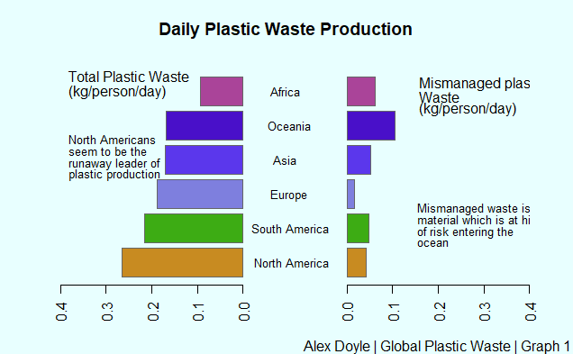

# Data_visualizations_C7083
### Table of Contents

  
1.0 Global Plastic Waste

   - 1.1 The base R plot

   - 1.2 The GGPlot
  
   - 1.3 The Interactive Plot
  
   - 1.4 The Interactive Map

2.0 The Big Mac Index

   - 2.1 The base R plot
  
   - 2.2 The GGplot
   
   - 2.3 The Shiny App
  
   - 2.4 The Animation

3.0 Plants in Danger
  
   - 3.1 The base R plot
  
   - 3.2 The GGplot
  
   - 3.3 The Sankey Diagram
  
   - 3.4 The Waffle Plot

4.0 Data Visualization Critique

  - The Good 
  
  - The Bad 

5.0 Bibliography 


```{r libraries, include = FALSE}
library(janitor)
library(tidyverse)
```


```{r data, include = FALSE}
coast_vs_waste <- readr::read_csv("https://raw.githubusercontent.com/rfordatascience/tidytuesday/master/data/2019/2019-05-21/coastal-population-vs-mismanaged-plastic.csv")

mismanaged_vs_gdp <- readr::read_csv("https://raw.githubusercontent.com/rfordatascience/tidytuesday/master/data/2019/2019-05-21/per-capita-mismanaged-plastic-waste-vs-gdp-per-capita.csv")

waste_vs_gdp <- readr::read_csv("https://raw.githubusercontent.com/rfordatascience/tidytuesday/master/data/2019/2019-05-21/per-capita-plastic-waste-vs-gdp-per-capita.csv")
```


### 1.0 Global Plastic Waste 


Plastic waste is an ever-increasing problem on a global scale. Its effects can be seen on the world's oceans with the unfortunate existence of the Great Pacific Garbage Patch a prime example. It consists of a region of the Pacific where plastic waste is gathered by ocean currents and is estimated to cover 1.6 million km^2 (3 times the size of France)(Lebreton,  L. *et al*, 2018). The data outlined below therefore focuses heavily on the plastic waste production as well as mismanaged waste. Mismanaged waste is described as material that is littered or inadequately disposed of. This inadequately disposed waste that could eventually enter oceans via waterways, water outflows and transport by wind (Jambeck, J.R., *et al*, 2015). With the data for this analysis having been gathered for the paper "Plastic waste inputs from land into the ocean" Jambeck et a.l (2015) and made available from the [**Our World in Data**](https://ourworldindata.org/plastic-pollution) website. The paper can be found [**here**](https://science.sciencemag.org/content/347/6223/768).  

Also included required for graph 3 is the Annual Production Based emission of carbon dioxide (CO ~2~), measured in tonnes per year. It been has also been compiled by [**Out World in Data**](https://ourworldindata.org/plastic-pollution) from a number of [**sources**](https://ourworldindata.org/grapher/annual-co-emissions-by-region) and finally included was the continents data set from [**Data Hub**](https://datahub.io/) and can be found [**here**](https://datahub.io/JohnSnowLabs/country-and-continent-codes-list) and was created by [**John Snow Labs**](https://www.johnsnowlabs.com/). 


The data for this script consists of 3 unique files each containing over 20,000 entries. The files are separated according to 2 variables and is outline below.


* `coast-population-vs-mismanaged-plastic.csv`


  |variable                         | class    | description                                |
  |:--------------------------------|:---------|:-------------------------------------------|
  | Entity                          | Character| Country Name                               |
  | Code                            | Character| 3 letter country code                      |
  | Year                            | Integer  | Year                                       |
  | Mismanaged plastic waste(tonnes)| double   | Tonnes of mismanaged plastic waste         |
  | Coastal population              | Double   | Number of individuals living on/near coast |
  | Total population                | double   | Total population according to Gapminder    |
  
  
  

* `waste_vs_gdp`


  |variable                         | class    | description                                |
  |:--------------------------------|:---------|:-------------------------------------------|
  | Entity                          | Character| Country Name                               |
  | Code                            | Character| 3 letter country code                      |
  | Year                            | Integer  | Year                                       |
  | Per capita plastic waste (kg per person per day) | double   | Amount of plastic waste per capita in kg/day|
  | GDP per capita             | Double   | GDP per capita constant 2011 international $, rate |
  | Total population                | double   | Total population according to Gapminder    |
  

  

* `mismanaged_vs_gdp`


  |variable                         | class    | description                                |
  |:--------------------------------|:---------|:-------------------------------------------|
  | Entity                          | Character| Country Name                               |
  | Code                            | Character| 3 letter country code                      |
  | Year                            | Integer  | Year                                       |
  | Per capita mismanaged plastic waste (kg per day)| double   | Amount of mismanaged plastic waste per capita in kg/day|
  | GDP per capita             | Double   | GDP per capita constant 2011 international $, rate |
  | Total population                | double   | Total population according to Gapminder    | 


Looking at the output the table shows that the number of rows that have data for certain variables is very low. In the `coast_vs_waste` data set had only 186 rows that were not empty working out at `r er`% of the total number of rows. On closer inspection is shows that the only year that any of the countries had data for was 2010. Cleaning up the datasets and combining them into one table with 9 rows and 235 observations. The aim of the first plot was to explore the differences in mismanaged plastic vs the more general plastic waste. The number of countries to display was far too high but by adding a dataset that contained the country codes and the continent it was possible to group the countries into the continent and look at the trends. 


#### 1.1 - The base R plot




The aim for Graph 1.1 was to compare the average amount of waste plastic and mismanaged plastic a person produces a day. While production did vary within the continents there were far too many countries to display efficiently so the countries were grouped by continents and the average was calculated. 


#### 1.2 - The GGplot
From plot one we learned that the continents that produce the most plastic waste per person per day tend to dispose of that plastic more carefully and on first appearances is seems that these higher producing countries are richer and more developed in comparison to the high mismanaged waste producers. The aim of the ggplot was therefore to look at the effects of income on the types of plastic waste produced. To make it more readable the axis are on the log scale which is important to remember. Again the plot is divided by the types of plastic and coloured according to the continents to try and decipher trends. Looking at the graph it does indicate as a countries GDP increases it seems to increase plastic waste production compared to the mismanaged waste which had a negative relationship with GDP.   


#### 1.3 - The Interactive Plot
For the interactive plot, the aim was to add to the scatter plot in the previous as it suited the type of data that was being displayed. Adding the CO~2~ data too added another layer as it was a different way of looking at it in comparison to gdp. The interactivity also allows for zooming in on the concentrated points in the corner around the origin without needing to use the log scale. 

{width=65%}

An interactive version of the is available on Rpubs https://rpubs.com/alexdoyle115/mismanaged_waste

#### 1.4 - The Interactive Map
An interactive map was a key data visualization for this assignment and this data was perfect. Colouring the map by the mismanaged plastic waste gives a good indicator of the countries that produce the most of waste. This really highlights the contribution China makes to global ocean pollution. 

{width=65%}

An interactive version of the is available on Rpubs https://rpubs.com/alexdoyle115/waste_map


### 2.0 The Big Mac Index


The Big Mac was invented by The Economist in 1986 as a way to compare a currencies exchange rate and its purchasing power. The index is based off of the theory of purchasing-power parity (PPP) which says that in the long-term exchange rates would shift to a point where prices for the same goods should be equalized. The infographic below from the economist website outlines the theory very well and can be found [**here**](https://infographics.economist.com/2018/big-mac/images/bigmac_INTRO_ai2html-raw2.png). The index is updated biannually by The Economist and an interactive app is available [**here**](https://www.economist.com/big-mac-index)


. The continents data set from [**Data Hub**](https://datahub.io/) and can be found [**here**](https://datahub.io/JohnSnowLabs/country-and-continent-codes-list) and was created by [**John Snow LABS**](https://www.johnsnowlabs.com/) provided a link between the 3 letter country codes used in the data and the 2 letter country codes that ggflags runs on. 
* `big-mac.csv`


|Variable       | Class     | Description                                  |
|:--------------|:----------|:----------------------------------------------| 
| date          | Date      | Date of observation                           |
| iso_a         | Character | International 3 Letter Country Code           |
| currency_code | Character | International 3 Letter Currency Code          |
| name          | Character | Country name                                  |
| local_price   | Number    | Price of a big mac in the local currency      |
| dollar_ex     | Number    | Local currency units per dollar               |
| dollar_price  | Number    | Price of a Big mac in US dollars              |
| USD_raw       | Number    | Raw index, relative to the US dollar          |
| EUR_raw       | Number    | Raw index, relative to the Euro               |
| GBP_raw       | Number    | Raw index, relative to the British Pound      |
| JPY_raw       | Number    | Raw index, relative to the Japanese Yen       |
| CNY_raw       | Number    | Raw index, relative to the Chinese yuan       |
| GDP_dollar    | Number    | GDP per person, in dollars                    |
| adj_price     | Number    | GDP-adjusted price of a Big Mac in dollars    |
| USD_adjusted  | Number    | Adjusted index, relative to the US dollar     |
| EUR_adjusted  | Number    | Adjusted index, relative to the Euro          |
| GBP_adjusted  | Number    | Adjusted index, relative to the British Pound |
| JPY_adjusted  | Number    | Adjusted index, relative to the Japanese yen  |
| CNY_adjusted  | Number    | Adjusted index, relative to the Chinese yuan  |
 


#### 2.1 - The base R plot
The basis of PPP says that exchange rates should trend towards a point where long-term exchange rates should shift towards a point where the same goods and services have the same price. In the real world this theory is impacted by factors such as poverty,  tariffs and the imperfectness of real-world economics (Lian, L., Lan, Y., 2003 ). Despite this it was worth looking at the extremes of the Big Mac index. By taking the minimum and maximum of each date to see if overvaluations and undervaluation were decreasing. It appears to be increasing but this may be due to more countries being added as the years go by. 


#### 2.2 - The GGplot
Moving now to look at for a trend in how valuations have changed over time. Using a cleveland plot for this type of visualization was suitable as it shows the change in valuation over time. Another approach would be to use a line graph to explore the various paths of the data, but it would be a very difficult diagram to read. Instead focusing on start and end points it offers the more generalized view that in comparison to the UD$ the valuation at least in terms of Big Macs is trending towards currencies being undervalued. 


\newpage

#### 2.3 - The Shiny App
The interactivity and flexibility that a shiny app enables to quickly display reactive information made it perfect for displaying information such as this. With the time series data as well as the different indexes available to show trying to use a traditional graph would have resulted in complex mess. The Shiny app allows a user to display whatever countries they so choose and in terms of the scale they want (Exchange Rate, Local Price or Value). 


The shiny app can be found at the link here https://dataweb.shinyapps.io/big_mac_app/


#### 2.4 - The Animation
For the final plot in the series an animation was the go-to selection. Using the time series element of the data to create a bar race to show the top 10 most expensive countries to purchase a big mac at each time interval. 


### 3.0 Plants in Danger 

The [**International Union for Conservation of Natures' Red List of Threatened Species**](https://www.iucnredlist.org/) is data source regarding to range, population size, conservation status and much more of all types of animal, fungi and plant species. The main aim of such a list is to provide information to government agencies, wildlife departments, NGOs, and the general public about the decline in biodiversity and number of species facing extinction. The dataset for these graphics was scraped by Florent Lavergne for his [**unique infographic**](https://www.behance.net/gallery/98304453/Infographic-Plants-in-Danger). Florent created this project to outlines the number of plants at high risk of extinction as he felt that plants are often underrepresented in comparison  to animals at risk of extinction.  
 


* `threats.csv`

| Variable          | Class     | Description                              |
|-------------------|-----------|------------------------------------------|
| binomial_name     | character | Species name (Genus + species)           |
| country           | character | Country of origin                        |
| continent         | character | Continent of origin                      |
| group             | character | Taxonomic group                          |
| year_last_seen    | character | Period species was last seen             |
| red_list_category | character | IUCN Red List category                   |
| threat_type       | character | Type of threat                           |
| threatened        | double    | Binary 0 (not threatened) 1 (threatened) |

* `action.csv`

| Variable          | Class     | Description                              |
|-------------------|-----------|------------------------------------------|
| binomial_name     | character | Species name (Genus + species)           |
| country           | character | Country of origin                        |
| continent         | character | Continent of origin                      |
| group             | character | Taxonomic group                          |
| year_last_seen    | character | Period species was last seen             |
| red_list_category | character | IUCN Red List category                   |
| action_type       | character | Type of action                           |
| action_taken      | double    | Binary 0 (not threatened) 1 (threatened) |


The data is downloaded in 3 different sets, with the `plant.csv` being the original and the `threat.csv`and `actions.csv` are filtered down versions of it. For that reason, all of the graphs are based off of these 2 smaller data sets as they were easier to explore.


#### 3.1 - The Base R plot
Starting off the plots it is looking at the threats that have faced plants over the decades and how they have changed. Plotting the 7 main threats, threats not recorded as well as a combination of the 3 smallest threats gives a good understanding how things have changed. Energy and Mining for example show a temporary spike that soon returns to original levels sparking interest in what caused this. 


#### 3.2 - The GGPlot
The final plot that was created aims to display the change in the rate of extinction as well as the number of plants that are saved from complete extinction through intervention such as seed banks. It is simple but effective. 


#### 3.3 - The Sankey Diagram
For the interactive plot the aim was to show the relationship between the threats, countries and how they have changed over time there were several plots that may have achieved this. The Sankey Diagram allowed for a clearer image of the "flow" of the different sections while the interactivity allows for focusing on individual nodes and streams.
A link to an interactive version is available on Rpubs https://rpubs.com/alexdoyle115/plant_in_danger
 


#### 3.4 - The Waffle Plot
Across the previous plots the information has been focused on the various threats to the plants that may have led to the plants going extinct (in the wild). The actions data set received little attention; this was mainly due to its contents. Looking at the waffle plot below it clearly shows the number of unknown/no actions taken outweighs all the other actions. The waffle plot offers the ability to show the imbalance and highlights the lack of Education & Awareness actions being taken.  
